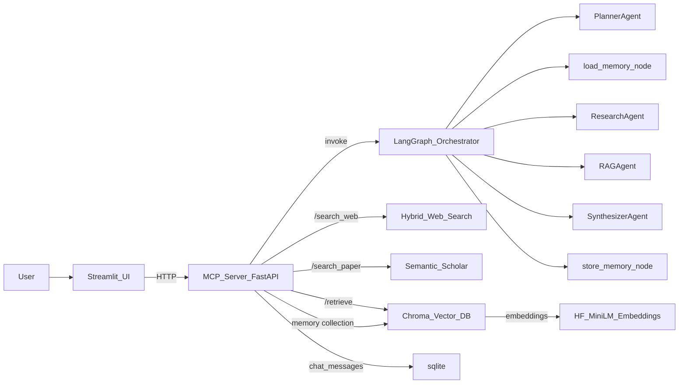
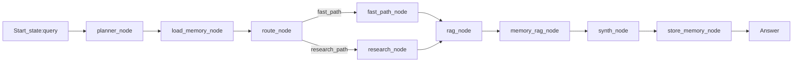

# System Overview — AI Research Assistant (LangGraph + MCP + RAG + SQLite + Streamlit)

Tài liệu này mô tả **đầy đủ thông tin, cấu trúc và flow hoạt động** của hệ thống để phục vụ demo, bảo trì và mở rộng.

---

## 1) Mục tiêu hệ thống

Hệ thống là một **research assistant** đa tác tử (multi-agent) với:

- **LangGraph orchestration** cho pipeline agent.
- **MCP server (FastAPI)** làm “tool layer” và API gateway cho UI.
- **Hybrid Web Search**: Tavily (nếu có key) → fallback DuckDuckGo.
- **Paper search**: Semantic Scholar public API (không cần key).
- **RAG**: Chroma Vector DB + **HuggingFace embeddings** local (`all-MiniLM-L6-v2`).
- **SQLite session history**: lưu hội thoại theo `session_id`.
- **Single pipeline**: chỉ 1 LangGraph pipeline duy nhất (production).
- **Streamlit UI** cho demo.
- **Optional observability**: LangSmith tracing (bật khi có `LANGCHAIN_API_KEY`).
- **Session memory (NEW)**:
  - short-term memory: SQLite chat history theo `session_id`
  - long-term memory: semantic memory store trong Chroma (scoped theo `session_id`)

---

## 2) Kiến trúc tổng quan



---

## 3) Cấu trúc thư mục & vai trò file

```
.
├── agents/
│   ├── planner.py           # tạo plan: ["search_web","search_paper","retrieve","synthesize"]
│   ├── router.py            # heuristic router: fast_path vs research_path
│   ├── research_agent.py    # simple research: one-pass web + paper
│   ├── rag_agent.py         # gọi MCP /retrieve (via ToolClient)
│   ├── memory_nodes.py      # load_memory / memory_rag / store_memory
│   └── synth_agent.py       # OpenRouter -> fallback (consumes context)
├── graph/
│   ├── state.py             # unified GraphState contract (TypedDict)
│   └── build_graph.py       # production pipeline: planner->load_memory->router->(fast|research)->rag->memory_rag->synth->store_memory
├── mcp_server/
│   ├── server.py            # FastAPI endpoints + SQLite + orchestration wrappers
│   └── Dockerfile
├── mcp_client/
│   ├── client.py            # MCP client GET/POST wrappers
│   └── tools.py             # ToolClient abstraction (centralize endpoints/timeouts/errors)
├── rag/
│   ├── vector_store.py      # Chroma + HF embeddings + bootstrap seed docs (chunked)
│   └── chunking.py          # deterministic rule-based chunker
├── session_manager.py       # SQLite session history (chat_messages)
├── memory_store.py          # Chroma-based long-term memory store (scoped by session_id)
├── ui.py                    # Streamlit demo UI (single pipeline)
├── ui_graph.py              # (removed; previously Streamlit graph viewer)
├── main.py                  # CLI runner (production pipeline), optional LangSmith
├── docker-compose.yml       # services: mcp, app, ui + volumes
├── requirements.txt
├── .env.example
└── README.md
```

---

## 4) MCP API surface (FastAPI)

### Health

- **GET** `/health`
  - Output: `{ "status": "ok" }`

### Web search (hybrid)

- **GET** `/search_web?q=...`
  - Behavior:
    - Tavily nếu có `TAVILY_API_KEY`
    - fallback DuckDuckGo nếu Tavily fail / thiếu key
  - Output:
    - `{ "query": str, "results": [{ "title": str, "content": str }], "cached": bool }`

### Paper search (free)

- **GET** `/search_paper?q=...`
  - Output:
    - `{ "query": str, "results": [{ "title": str, "abstract": str }], "cached": bool }`
  - Demo-safe: lỗi → `results: []`

### RAG retrieve

- **GET** `/retrieve?q=...&k=3`
  - Output:
    - `{ "query": str, "k": int, "docs": [{id,text,score,metadata}], "cached": bool }`

### Orchestration run (single)

- **POST** `/run`
  - Input:
    - `{ "q": "...", "session_id": "optional" }`
  - Behavior:
    - invoke single production pipeline
    - capture stdout logs
  - Output:
    - `{ query, plan, web_results, papers, context, answer, errors, observations, logs }`

---

## 5) Luồng xử lý theo agent pattern

### 5.1 Production pipeline (single)



- `planner_node`: tạo `plan` và log `[Planner]`
- `route_node`: heuristic routing để giảm tool calls không cần thiết
- `route_node` (uncertainty-aware):
  - nếu `memory_quality` cao + follow-up → `fast_path`
- `fast_path_node`: skip web/paper live calls (giữ schema ổn định cho downstream)
- `research_node`: gọi web search + paper search (1 lần), ghi `errors/observations` (demo-safe)
- `rag_node`: lấy docs từ Chroma
- `load_memory_node`: load history + memory_hits theo `session_id`
  - load short-term history: last 5 messages từ SQLite `chat_messages`
  - build search query: `state["query"] + last_user_messages`
  - retrieve `memory_hits` từ Chroma (filter theo `session_id`) + include similarity score
  - compute per memory:
    - `recency = exp(-time_diff / tau)`
    - `usage_score = log(1 + usage_count)`
    - `final_score = 0.4*similarity + 0.2*recency + 0.3*importance + 0.1*usage_score`
  - sort by `final_score`, keep top-k (3–5)
  - set state:
    - `memory_topk` = number selected
    - `memory_quality` = avg(`final_score`)
    - `memory_sufficient` = `memory_quality > 0.6`
  - detect `memory_conflict`:
    - contradictory keywords heuristic OR low similarity variance
- `memory_rag_node`: inject context có cấu trúc rõ ràng:
  - `[Conversation History]`
  - `[Relevant Past Knowledge]`
  - `[Retrieved Documents]`
- `synth_node`: gọi OpenRouter hoặc fallback (có `context`)
- `store_memory_node`: lưu `query` + `answer` vào SQLite history và ghi long-term memory (best-effort)
  - ALWAYS `save_message(session_id,"user",query)` và `save_message(session_id,"assistant",answer)` (nếu có answer)
  - long-term memory store ONLY khi:
    - `len(answer) > 100`
    - answer không rỗng
    - query không phải greeting
  - stored payload:
    - full answer
    - `summary` = 2 câu đầu tiên
  - stored metadata:
    - `importance` (0..1), `usage_count`, `created_at`, `last_used`, `type`
  - usage tracking:
    - increment `usage_count` và update `last_used` cho memories đã được dùng trong run

---

## 6) DB & persistence

### 6.1 SQLite path

- Mặc định: `/app/data/research.db` (env: `RESEARCH_DB_PATH`)
- Docker: mount volume vào `/app/data` để persist

### 6.2 Schema

#### papers

- id, title, abstract, source, created_at
- Unique index theo `title` để dedupe.

#### history

- id, query, pattern, answer, created_at
- Dùng để phân tích so sánh outputs theo pattern.

#### tool_cache

(Đã loại bỏ tool_cache SQLite. MCP chỉ giữ in-memory TTL cache.)

#### chat_messages (NEW)

- session_id, role, content, created_at
- Lưu hội thoại theo session; loader chỉ lấy last N (3–5) để inject vào prompt

---

## 7) RAG & Embeddings

### 7.1 Chroma

- Persist dir: `CHROMA_PERSIST_DIR` (default `/app/chroma_db`)
- Collection: `research_assistant_docs_hf_minilm_l6_v2`
- Memory collection: `research_assistant_memory` (scoped theo `session_id`)

### 7.2 Embeddings

- Model: `sentence-transformers/all-MiniLM-L6-v2`
- Cache model: `/app/cache`
- Optional auth:
  - `HF_TOKEN` → set `HUGGINGFACEHUB_API_TOKEN`
  - log: `[HF] Authenticated` hoặc `[HF] No token (public mode)`

---

## 8) LLM synthesis

- Primary: OpenRouter (`OPENROUTER_API_KEY`, `OPENROUTER_MODEL`)
- Failure: fallback summary (demo-safe)

---

## 9) Observability (optional)

- LangSmith bật khi có `LANGCHAIN_API_KEY`
- Log ở runtime: `[LangSmith] ENABLED` / `[LangSmith] DISABLED`
- Structured runtime state:
  - `errors`: list các lỗi tool/DB (không raise)
  - `observations`: tool call traces (tool, input, output size, ok)

---

## 10) Docker services & ports

### Services (docker-compose.yml)

- `mcp`:
  - host: `localhost:8001` → container `8000`
  - volumes:
    - `chroma_data:/app/chroma_db`
    - `research_db_data:/app/data`
- `ui`:
  - host: `localhost:8501`
  - calls MCP bằng `MCP_URL=http://mcp:8000` (internal)
- `app` (CLI runner, optional):
  - runs single production pipeline (no server start)

---

## 11) Demo checklist nhanh

1. `docker-compose up --build`\n2. Mở UI: `http://localhost:8501`\n3. Nhập query → Run\n4. Xem answer + logs

---

## 12) Graph Viewer

Đã loại bỏ phần trực hoá graph trong UI (tab Graph Viewer / `streamlit-agraph`).
