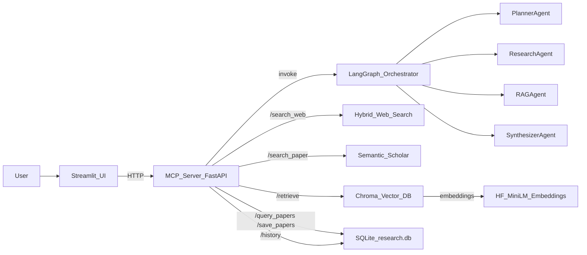

# System Overview — AI Research Assistant (LangGraph + MCP + RAG + SQLite + Streamlit)

Tài liệu này mô tả **đầy đủ thông tin, cấu trúc và flow hoạt động** của hệ thống để phục vụ demo, bảo trì và mở rộng.

---

## 1) Mục tiêu hệ thống

Hệ thống là một **research assistant** đa tác tử (multi-agent) với:
- **LangGraph orchestration** cho pipeline agent.
- **MCP server (FastAPI)** làm “tool layer” và API gateway cho UI.
- **Hybrid Web Search**: Tavily (nếu có key) → fallback DuckDuckGo.
- **Paper search**: Semantic Scholar public API (không cần key).
- **RAG**: Chroma Vector DB + **HuggingFace embeddings** local (`all-MiniLM-L6-v2`).
- **SQLite research cache**: lưu & truy vấn lại papers để giảm gọi API.
- **Compare patterns**: chạy nhiều pattern trên cùng query (`react`, `planner`, `rewoo`) + lưu lịch sử.
- **Streamlit UI** cho demo.
- **Optional observability**: LangSmith tracing (bật khi có `LANGCHAIN_API_KEY`).

---

## 2) Kiến trúc tổng quan



---

## 3) Cấu trúc thư mục & vai trò file

```
.
├── agents/
│   ├── planner.py           # tạo plan: ["search_web","search_paper","retrieve","synthesize"]
│   ├── router.py            # heuristic router: fast_path vs research_path
│   ├── research_agent.py    # bounded ReAct loop + DB cache integration (/query_papers, /save_papers) + observations/errors
│   ├── rag_agent.py         # gọi MCP /retrieve (via ToolClient)
│   ├── context_compress.py  # compress docs -> context (rule-based)
│   ├── critic.py            # guardrail + bounded retry signal (1 extra RAG pass)
│   └── synth_agent.py       # OpenRouter -> fallback (consumes context)
├── graph/
│   ├── state.py             # unified GraphState contract (TypedDict)
│   └── build_graph.py       # adaptive graph: planner->router->(fast_path|research)->rag->compress->synth->critic
├── mcp_server/
│   ├── server.py            # FastAPI endpoints + SQLite + orchestration wrappers
│   └── Dockerfile
├── mcp_client/
│   ├── client.py            # MCP client GET/POST wrappers
│   └── tools.py             # ToolClient abstraction (centralize endpoints/timeouts/errors)
├── rag/
│   ├── vector_store.py      # Chroma + HF embeddings + bootstrap seed docs (chunked)
│   └── chunking.py          # deterministic rule-based chunker
├── ui.py                    # Streamlit demo UI (compare + history)
├── main.py                  # CLI runner (planner/react/rewoo), optional LangSmith
├── docker-compose.yml       # services: mcp, app, ui + volumes
├── requirements.txt
├── .env.example
└── README.md
```

---

## 4) MCP API surface (FastAPI)

### Health
- **GET** `/health`
  - Output: `{ "status": "ok" }`

### Web search (hybrid)
- **GET** `/search_web?q=...`
  - Behavior:
    - Tavily nếu có `TAVILY_API_KEY`
    - fallback DuckDuckGo nếu Tavily fail / thiếu key
  - Output:
    - `{ "query": str, "results": [{ "title": str, "content": str }], "cached": bool }`

### Paper search (free)
- **GET** `/search_paper?q=...`
  - Output:
    - `{ "query": str, "results": [{ "title": str, "abstract": str }], "cached": bool }`
  - Demo-safe: lỗi → `results: []`

### RAG retrieve
- **GET** `/retrieve?q=...&k=3`
  - Output:
    - `{ "query": str, "k": int, "docs": [{id,text,score,metadata}], "cached": bool }`

### Orchestration run (single)
- **POST** `/run`
  - Input:
    - `{ "q": "..." }`
  - Behavior:
    - invoke full LangGraph pipeline (planner flow)
    - capture stdout logs
  - Output:
    - `{ query, plan, web_results, papers, context, answer, errors, observations, logs }`

### Compare multiple patterns (NEW)
- **POST** `/run_compare`
  - Input:
    - `{ "query": str, "patterns": ["react","planner","rewoo"] }`
  - Output:
    - `{ "query": str, "results": { pattern: { answer, plan, errors, observations, logs } } }`
  - Logs:
    - `[Compare] Running pattern: ...`
    - `[History] Saved`

### Research DB cache (SQLite)
- **POST** `/save_papers`
  - Input: `{ "papers": [{ "title", "abstract", "source" }] }`
  - Output: `{ "inserted": n, "ignored": m }`
  - Logs: `[DB Save] ...`

- **GET** `/query_papers?q=...`
  - Output (top 3):
    - `[{ "title": "...", "content": "..." }]`
  - Logs: `[DB Query] ...`

### History (SQLite)
- **GET** `/history`
  - Output:
    - `[{ "query": "...", "pattern": "...", "answer": "...", "time": "..." }]` (last 20)

---

## 5) Luồng xử lý theo agent pattern

### 5.1 Planner/ReWOO (full pipeline, adaptive)

```mermaid
flowchart LR
  start[Start_state:query] --> planner[planner_node]
  planner --> router[route_node]
  router -->|fast_path| fast[fast_path_node]
  router -->|research_path| research[research_node]
  fast --> rag[rag_node]
  research --> rag
  rag --> compress[context_compress_node]
  compress --> synth[synth_node]
  synth --> critic[critic_node]
  critic -->|retry_rag (bounded)| rag
  critic -->|end| endNode[Answer]
```

- `planner_node`: tạo `plan` và log `[Planner]`
- `route_node`: heuristic routing để giảm tool calls không cần thiết
- `fast_path_node`: skip web/paper live calls (giữ schema ổn định cho downstream)
- `research_node`: bounded ReAct + DB cache + ghi `errors/observations` (demo-safe)
- `rag_node`: lấy docs từ Chroma
- `context_compress_node`: nén docs thành `context: str` để giảm prompt bloat
- `synth_node`: gọi OpenRouter hoặc fallback (có `context`)
- `critic_node`: guardrail + bounded retry (1 pass) nếu thiếu sources/docs

### 5.2 ReAct pattern (no planner node)

```mermaid
flowchart LR
  start[Start_state:query] --> research[research_node]
  research --> rag[rag_node]
  rag --> compress[context_compress_node]
  compress --> synth[synth_node]
  synth --> critic[critic_node]
  critic -->|retry_rag (bounded)| rag
  critic -->|end| endNode[Answer]
```

Mục tiêu: rút gọn, nhanh, tập trung tool-use.

---

## 6) DB & persistence

### 6.1 SQLite path
- Mặc định: `/app/data/research.db` (env: `RESEARCH_DB_PATH`)
- Docker: mount volume vào `/app/data` để persist

### 6.2 Schema

#### papers
- id, title, abstract, source, created_at
- Unique index theo `title` để dedupe.

#### history
- id, query, pattern, answer, created_at
- Dùng để phân tích so sánh outputs theo pattern.

#### tool_cache (NEW)
- tool, query, response_json, created_at
- Unique index theo (tool, query)
- TTL logic đơn giản (env: `TOOL_CACHE_TTL_SECONDS`)

---

## 7) RAG & Embeddings

### 7.1 Chroma
- Persist dir: `CHROMA_PERSIST_DIR` (default `/app/chroma_db`)
- Collection: `research_assistant_docs_hf_minilm_l6_v2`

### 7.2 Embeddings
- Model: `sentence-transformers/all-MiniLM-L6-v2`
- Cache model: `/app/cache`
- Optional auth:
  - `HF_TOKEN` → set `HUGGINGFACEHUB_API_TOKEN`
  - log: `[HF] Authenticated` hoặc `[HF] No token (public mode)`

---

## 8) LLM synthesis

- Primary: OpenRouter (`OPENROUTER_API_KEY`, `OPENROUTER_MODEL`)
- Failure: fallback summary (demo-safe)

---

## 9) Observability (optional)

- LangSmith bật khi có `LANGCHAIN_API_KEY`
- Log ở runtime: `[LangSmith] ENABLED` / `[LangSmith] DISABLED`
- Structured runtime state:
  - `errors`: list các lỗi tool/DB (không raise)
  - `observations`: tool call traces (tool, input, output size, ok)

---

## 10) Docker services & ports

### Services (docker-compose.yml)
- `mcp`:
  - host: `localhost:8001` → container `8000`
  - volumes:
    - `chroma_data:/app/chroma_db`
    - `research_db_data:/app/data`
- `ui`:
  - host: `localhost:8501`
  - calls MCP bằng `MCP_URL=http://mcp:8000` (internal)
- `app` (CLI runner, optional):
  - runs `main.py` patterns (no server start)

---

## 11) Demo checklist nhanh

1. `docker-compose up --build`\n2. Mở UI: `http://localhost:8501`\n3. Chọn patterns (`react`, `planner`, `rewoo`) → Run\n4. Xem compare outputs + logs\n5. Xem History (last 20)\n6. Chạy lại cùng query → DB cache giúp reuse papers nhanh hơn\n+
